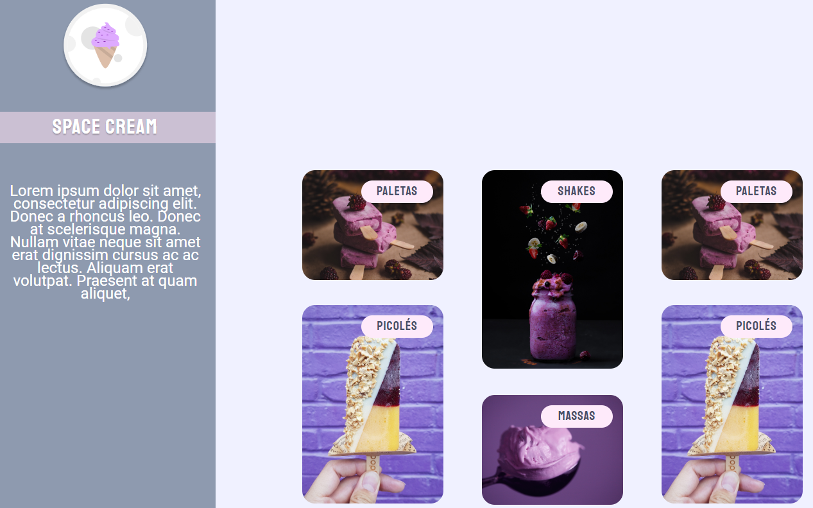

<h1><a href="#eng">Read in English 🇺🇸</a> | <a href="#pt-br">Leia em Português 🇧🇷</a></h1>

<h1 id="eng" style="color: yellow">English</h1>

<h2 id="about">About the project</h2>

<ul>
  
In this challenge I had to create an application from a Figma layout in order to practice what was learned in this Stage 03.
  
</ul>

Main skills learned

<ul>
  <li>Element centering</li>
  <li>Element positioning</li>
  <li>Flexbox</li>
  <li>Grid Layout</li>
  <li>CSS variables</li>
  <li>CSS Page Reset</li>
  <li>Responsive Web Design - Media Queries</li>
  <li>CSS @keyframes</li>
  <li>CSS Animations & Transitions</li>
</ul>

<a href="https://efficient-sloth-d85.notion.site/Grid-com-anima-es-5ea8b6051189446ebcda9914f7ac4dc9" target="_blank">Figma Layout</a>

<h2 id="tech">Technologies</h2>

<ul>
  <li>HTML</li>
  <li>CSS</li>
</ul>

<h2 id="explorer-program">About the Explorer Program</h2>
<ul>
  
The Rocketseat Explorer is a six month intensive Full-Stack program that helps those who are seeking to join the IT field, specifically in Web Development. The Explorer program focus exclusively on hard skills, soft skills and training through hands-on practical activities. The mottos are "never stop learning" and "learn by doing".
  
  <a href="https://www.rocketseat.com.br/explorer" target="_blank">Rocketseat Explorer Program (PT-BR only)</a>
</ul>

<h1 id="pt-br" style="color: yellow">Português</h1>

<h2 id="about-pt">Sobre o projeto</h2>

<ul>
  
Neste desafio eu tive que criar uma aplicação a partir de um layout do Figma para praticar o que foi aprendido neste Stage 03
  
</ul>
<ul>
  <li>Centralização de elemento</li>
  <li>Posicionamento de elemento</li>
  <li>Flexbox</li>
  <li>Layout Grid</li>
  <li>Variáveis no CSS</li>
  <li>Reset de CSS</li>
  <li>Responsividade Web - Media Queries</li>
  <li>@keyframes no CSS</li>
  <li>Animações e Transições no CSS</li>
</ul>
<a href="https://efficient-sloth-d85.notion.site/Grid-com-anima-es-5ea8b6051189446ebcda9914f7ac4dc9" target="_blank">Layout do Figma</a>

<h2 id="tech-pt">Tecnologias</h2>

<ul>
  <li>HTML</li>
  <li>CSS</li>
</ul>

<h2 id="explorer-program-pt">Sobre o Programa Explorer</h2>
<ul>
  
The Rocketseat Explorer is a six month intensive Full-Stack program that helps those who are seeking to join the IT field, specifically in Web Development. The Explorer program focus exclusively on hard skills, soft skills and training through hands-on practical activities. The mottos are "never stop learning" and "learn by doing".

  <a href="https://www.rocketseat.com.br/explorer" target="_blank">Programa Explorer da Rocketseat</a>
</ul>
